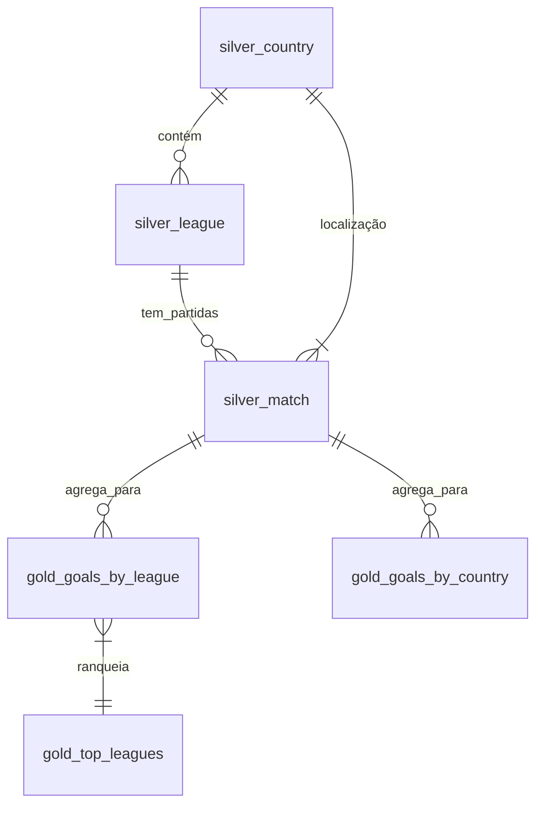
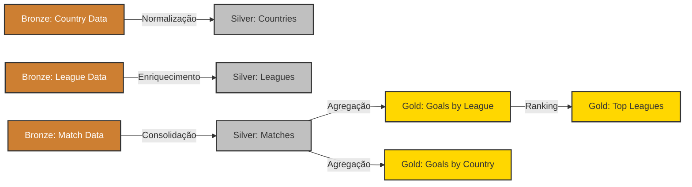

# 📊 Modelo de Dados

## 📦 Conjunto de Dados Utilizado: European Soccer Database

**Descrição:**  
O European Soccer Database é um conjunto de dados para análise e machine learning de partidas de futebol profissional europeu. Contém mais de 25.000 partidas, mais de 10.000 jogadores, atributos extraídos da série de videogames FIFA da EA Sports, dados de odds de apostas, eventos detalhados de partidas e formações de times, abrangendo 11 países europeus e temporadas de 2008 a 2016.

---

## 🗃️ Principais Tabelas

### 🏗️ Tabelas Originais

#### Table: country  
**Descrição:** Lista de países participantes.

| Coluna | Tipo   | Descrição                    |
|--------|--------|------------------------------|
| id     | long   | Identificador único do país  |
| name   | string | Nome do país                 |

---

#### Table: league  
**Descrição:** Ligas correspondentes a cada país.

| Coluna     | Tipo   | Descrição                                  |
|------------|--------|--------------------------------------------|
| id         | long   | Identificador único da liga                |
| name       | string | Nome da liga                               |
| country_id | long   | Referência ao `country.id`                 |

---

#### Table: team  
**Descrição:** Informação básica dos times.

| Coluna            | Tipo   | Descrição                               |
|-------------------|--------|-----------------------------------------|
| id                | long   | Identificador único do registro         |
| team_api_id       | long   | ID do time na API de partidas           |
| team_long_name    | string | Nome completo do time                   |
| team_short_name   | string | Sigla/nome curto do time                |
| team_fifa_api_id  | long   | ID do time na base FIFA                 |

---

#### Table: Match  
**Descrição:** Dados de partidas, incluindo resultados, estatísticas de jogo e odds de apostas.

| Coluna           | Tipo   | Descrição                                                |
|------------------|--------|----------------------------------------------------------|
| id               | long   | Identificador único da partida                           |
| date             | string | Data e horário da partida                                |
| country_id       | long   | Referência ao `country.id`                               |
| league_id        | long   | Referência ao `league.id`                                |
| season           | string | Temporada (ex: 2008/2009)                                |
| stage            | long   | Rodada da temporada                                      |
| home_team_goal   | long   | Gols do time da casa                                     |
| away_team_goal   | long   | Gols do time visitante                                   |
| B365H, B365D, B365A | double | Odds pré-jogo Bet365 (casa, empate, visitante)         |
| ...              | ...    | Outros campos de odds seguem padrões similares           |
| shoton, shotoff  | string | IDs de jogadores que chutaram (on target/off target)     |
| corner, cross    | string | IDs de jogadores envolvidos em escanteios e cruzamentos  |
| foulcommit       | string | IDs de jogadores que cometeram faltas                    |
| possession       | string | Percentual de posse de bola                              |
| home_player_1...Y11 | long | IDs e coordenadas X,Y da formação de jogadores          |
| card, goal       | string | Eventos de cartões e gols                               |

---

## 🏗️ Tabelas Derivadas (Camadas Silver e Gold)

### Camada Silver

#### Table: `silver_country`
**Descrição:** Países padronizados para análise.

| Coluna         | Tipo   | Descrição                     |
|----------------|--------|-------------------------------|
| country_id     | long   | ID único do país             |
| country_name   | string | Nome do país                 |

---

#### Table: `silver_league`  
**Descrição:** Ligas com informações de país associado.

| Coluna         | Tipo   | Descrição                     |
|----------------|--------|-------------------------------|
| league_id      | long   | ID único da liga             |
| league_name    | string | Nome da liga                 |
| country_name   | string | Nome do país da liga         |

---

#### Table: `silver_match`  
**Descrição:** Partidas consolidadas para análise.

| Coluna         | Tipo   | Descrição                     |
|----------------|--------|-------------------------------|
| match_id       | long   | ID único da partida          |
| season         | string | Temporada (ex: 2008/2009)    |
| total_goals    | long   | Soma de gols (casa + fora)   |
| country_name   | string | País da partida              |

---

### Camada Gold

#### Table: `gold_goals_by_league`  
**Descrição:** Métricas agregadas por liga e temporada.

| Coluna               | Tipo    | Descrição                              |
|----------------------|---------|----------------------------------------|
| country_name         | string  | Nome do país                          |
| league_name          | string  | Nome da liga                          |
| season               | string  | Temporada (ex: "2008/2009")           |
| total_goals          | long    | Soma de gols na temporada             |
| total_matches        | long    | Número de partidas                    |
| avg_goals_per_match  | double  | Média de gols por partida             |

---

#### Table: `gold_goals_by_country`  
**Descrição:** Agregados de gols por país.

| Coluna               | Tipo    | Descrição                              |
|----------------------|---------|----------------------------------------|
| country_name         | string  | Nome do país                          |
| season               | string  | Temporada                              |
| total_goals          | long    | Soma de gols (todas as ligas)         |
| avg_goals_per_match  | double  | Média de gols por partida no país     |

---

#### Table: `gold_top_leagues`  
**Descrição:** Ranking das top 5 ligas por média de gols.

| Coluna               | Tipo    | Descrição                              |
|----------------------|---------|----------------------------------------|
| country_name         | string  | Nome do país                          |
| league_name          | string  | Nome da liga                          |
| season               | string  | Temporada                              |
| avg_goals_per_match  | double  | Média de gols por partida             |
| rank                 | int     | Posição no ranking (1 a 5)            |

---

## 🔗 Relacionamentos

---

## 🔄 Fluxo de Transformação

