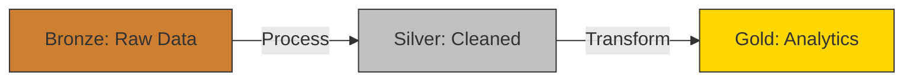

# Visão Geral da Arquitetura

A arquitetura de dados é fundamental para garantir a qualidade e a eficiência dos dados em um ambiente de Big Data. Ela envolve a definição de camadas de dados, fluxo de dados e processos de ingestão.

## Camadas

### Bronze
- Dados brutos imutáveis
- Formato Delta Lake
- Metadados de ingestão

### Silver
- Dados limpos e normalizados
- Schemas validados
- Particionamento estratégico

### Gold
- Dados analíticos
- Otimizado para consulta
- Pronto para dashboards e análises

## Fluxo de Dados
1. **Bronze**: Dados brutos são ingeridos e armazenados no formato Delta Lake.
2. **Silver**: Dados são limpos, normalizados e validados.
3. **Gold**: Dados são otimizados para análises e consultas.

## Diagrama do Fluxo

